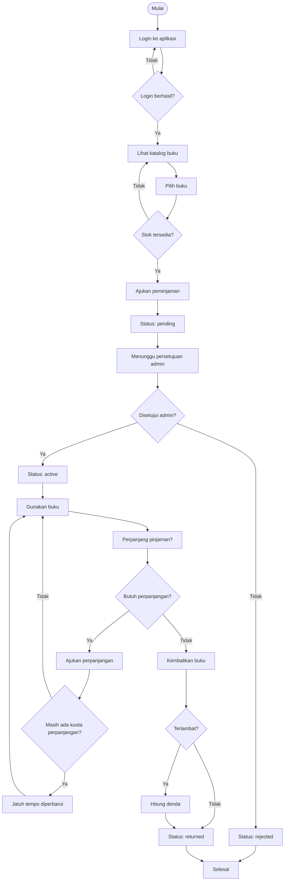
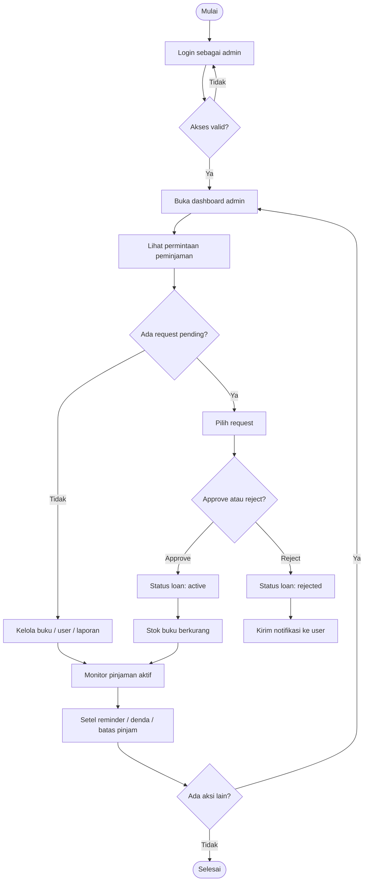

# WP-Library Activity Diagrams

Dokumen ini berisi diagram Mermaid untuk alur aktivitas user dan admin pada sistem WP-Library.

## User Activity Diagram

## Admin Activity Diagram

## Catatan

- Diagram di atas menggunakan Mermaid `flowchart` untuk mewakili activity diagram.
- Jika dibutuhkan, file ini bisa dipisah lagi menjadi diagram lebih detail untuk proses login, borrowing, approval, atau return.