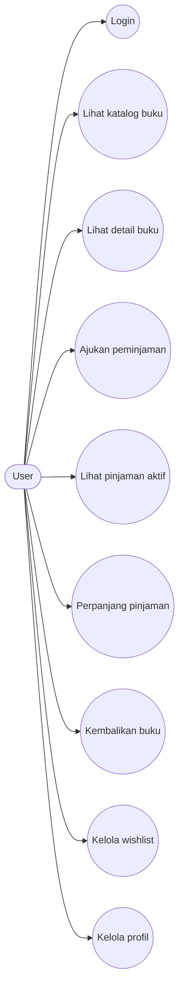
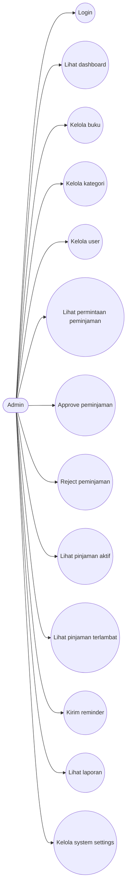

# WP-Library Use Case Diagrams

Dokumen ini berisi diagram use case Mermaid untuk aktor user dan admin pada sistem WP-Library.

## Use Case Diagram - User

## Use Case Diagram - Admin

## Catatan

- Mermaid tidak punya sintaks use case diagram UML yang benar-benar native, jadi diagram di atas dibuat dengan `flowchart` dan node berbentuk oval untuk merepresentasikan use case.
- Jika diperlukan, saya bisa gabungkan use case ini ke [MERMAID_ACTIVITY_DIAGRAMS.md](MERMAID_ACTIVITY_DIAGRAMS.md) atau tambahkan diagram untuk aktor lain seperti guest atau super admin.