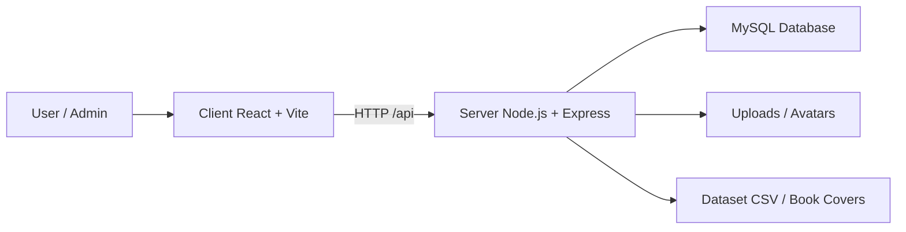

# WP-Library System Overview

Dokumen ini menjelaskan bentuk sistem WP-Library secara ringkas: komponen utama, alur data, dan tanggung jawab tiap bagian.

## Gambaran Umum

WP-Library adalah aplikasi perpustakaan digital berbasis web yang terdiri dari:

- Frontend `client` untuk tampilan pengguna dan admin.
- Backend `server` sebagai REST API dan logika bisnis.
- Database MySQL untuk data buku, user, peminjaman, notifikasi, dan setting sistem.
- Dataset CSV dan folder cover buku sebagai sumber impor data awal.

## Arsitektur Tingkat Tinggi

## Komponen Utama

### 1. Client

Folder `client/` berisi aplikasi frontend React yang menangani:

- autentikasi dan session user,
- navigasi halaman katalog, detail buku, pinjaman, wishlist, dan settings,
- dashboard admin untuk approval pinjaman, manajemen buku, dan laporan,
- pemanggilan API ke backend melalui `src/services/api.js`.

### 2. Server

Folder `server/` berisi backend Node.js + Express yang menangani:

- login dan registrasi,
- manajemen buku, kategori, user, wishlist, dan loan,
- approval atau penolakan peminjaman,
- perhitungan denda dan perpanjangan pinjaman,
- pengiriman reminder,
- upload avatar dan file terkait.

### 3. Database

Schema utama berada di `server/src/scripts/schema.sql`. Database menyimpan:

- `users` untuk akun user dan admin,
- `books` untuk katalog buku,
- `categories` untuk kategori buku,
- `loans` untuk peminjaman dan status prosesnya,
- `wishlists` untuk daftar favorit,
- `notifications` untuk pesan sistem,
- `system_settings` untuk konfigurasi yang bisa diubah tanpa mengubah kode,
- `system_logs` untuk jejak aktivitas.

## Alur Data

### Login

1. User login lewat client.
2. Client mengirim request ke backend.
3. Backend memverifikasi kredensial.
4. Backend mengembalikan JWT token dan data user.
5. Client menyimpan session dan memakai token untuk request berikutnya.

### Peminjaman Buku

1. User memilih buku dan mengirim request pinjam.
2. Backend membuat loan dengan status `pending`.
3. Admin melihat daftar `pending`.
4. Admin bisa `approve` atau `reject`.
5. Jika disetujui, status menjadi `active` dan stok buku berkurang.
6. Saat buku dikembalikan, status menjadi `returned` dan denda dihitung jika terlambat.

### Reminder dan Denda

1. Backend membaca nilai dari `system_settings`.
2. Reminder dikirim berdasarkan `reminder_days_before`.
3. Denda dihitung dari `fine_per_day`.
4. Perpanjangan dibatasi oleh `max_extensions`.

## Peran Folder

### Client

- `src/pages` menyimpan halaman.
- `src/components` menyimpan komponen reusable.
- `src/hooks/useAuth.jsx` mengelola autentikasi.
- `src/services/api.js` menjadi lapisan akses API.

### Server

- `src/controllers` menangani request dan response.
- `src/models` berisi akses database dan query.
- `src/routes` mendefinisikan endpoint API.
- `src/middleware` menangani autentikasi dan authorization.
- `src/scripts` berisi import data dan schema setup.

## Konfigurasi Sistem

Setting sistem disimpan di tabel `system_settings` agar perubahan aturan bisnis tidak perlu hardcode. Contoh setting yang dipakai aplikasi:

- `loan_period_days`
- `fine_per_day`
- `max_books_per_user`
- `max_extensions`
- `reminder_days_before`

## Ringkasan Bentuk Sistem

Secara sederhana, WP-Library adalah sistem tiga lapis:

1. Frontend untuk interaksi pengguna.
2. Backend untuk aturan bisnis dan API.
3. Database untuk penyimpanan data dan konfigurasi.

Dengan struktur ini, UI, logika bisnis, dan data dipisahkan dengan jelas sehingga lebih mudah dirawat dan dikembangkan.